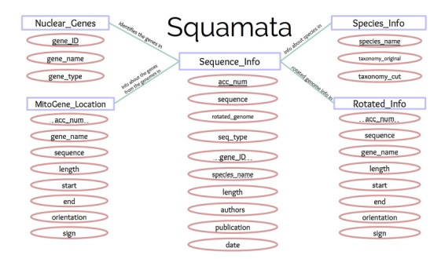

Hi Louise!  Welcome to the database.
Here are some instructions for operating and using it.

To update the database:

Open terminal to the Squamata folder.  Open the file 'update_db.py'.  In line 12, set the variable email equal to your email in quotes.  The program will feed this email address into all the other files, allowing Genbank to use your email.  Save the file and run 'python update_db.py' in terminal.  It will take about 15 minutes to run because of Genbank's requirements for staggering requests.

Doing the above will completely delete and repopulate the database with the current search results on Genbank.  It will NOT update the nuclear gene data, it will just put the old data back into the database.  To update the nuclear genes, follow the instructions below.


To update the nuclear genes:

Go into the folder Nuclear_Fastas in the Squamata folder and delete all the files inside it.

Open the file 'nuclear_genes.py'.  At the botton of the file, type your email in the parentheses so it reads nuclear_genes('youremail@example.com').  Then, run 'python nuclear_genes.py' in the terminal.

***important*** this query is very long and you are required by Genbank to only perform it outside of peak hours. (peak hours are Mon-Fri 8am-7pm EST) When running your file, change line 7 to sleep(x), where x is the appropriate number of seconds that will make the file start outside peak hours.  If you don't do this, Genbank will be very very mad and may block your IP address.

Next, run 'python best_sequence.py' in terminal.  Then, open update_db.py and select lines 14-19.  Hit command+? to comment out these commands, then run 'python update_db.py' in terminal to repopulate the database.  When the file has finished running, select lines 14-18 again and hit command+? to uncomment them.


To access the database, type 'sqlite3 squamata.db' in terminal.  The database is a standard SQL database.

Some helpful SQL tips:
https://docs.google.com/document/d/1G0rl5EImTMMpVqS2vTtFZiK_IgNSXLeHW2XC3gRTxLY/edit?usp=sharing

.schema shows you what is in every table
.help has a list of settings that you can change
select column1, column2, ... from Table; --> prints data; use * to select all columns from a table
joins are explained in the link above

The file faulty_acc_nums.txt is a file containing the accession numbers for Genbank files of nuclear genes that for whatever reason were returned in searches for multiple genes.  They have to be manually looked through and added to the database if they contain useful information.  They will need to be repopulated into the database each time you run 'update_db.py'.

To make a CSV file from database output:

```
sqlite3 squamata.db
.mode csv
.once file_name
select column1, column 2 from Table; (or any other select command)
```

A fasta file of every rotated gene with its accession number and family, genus, and species names is in 'master_fasta.fasta'


A run-through of the schema:

Sequence_Info contains information about the entry in Genbank.  Sequence_Info.rotated_genome is only populated for entries of genomes and is the sequence beginning with the COX1 gene.  Sequence_Info.seq_type refers to mitochondrial ('m') vs. nuclear ('n').

Genes contains information about the nuclear genes only.  Each nuclear gene entry is the most robust sequence for a certain gene and species; all nuclear genes in the database are from species that also have a complete mitochondrial genome in the database.  Genes.gene_ID is a unique ID number for each nuclear gene entry in our database.  Genes.gene_name is the standardized name for the gene (e.g. RAG1).  Genes.gene_type again is to 'n' for nuclear.

MitoGene_Location contains metadata about the mitochondrial genomes and the position of the genes within them.  MitoGene_Location.gene_name is the standardized name of the gene (e.g. COX1).  MitoGene_Location.sequence is the sequence of the complete genome spliced based on the start and end locations of the gene; start and end use Python index numbers (i.e. they start at 0 and one is subtracted from the end value).  MitoGene_Location.orientation refers to whether the gene is read forwards or backwards (its complement).  MitoGene_Location.sign refers to any ambiguities in start or end ("less than start" means that the start may actually be slightly earlier than the number given, while "greater than end" means that the end may be slightly after the number given).

Species_Info.taxonomy_original refers to the complete taxonomy for a certain species; Species_Info.taxonomy_cut starts at 'Squamata'.

Rotated_Info contains the same information as MitoGene_Location, but with start and end values modified to correspond to Sequence_Info.rotated_genome, which begins with the COX1 gene.


